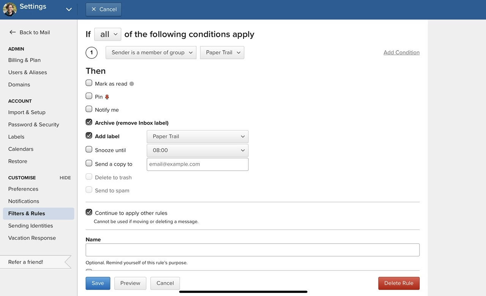
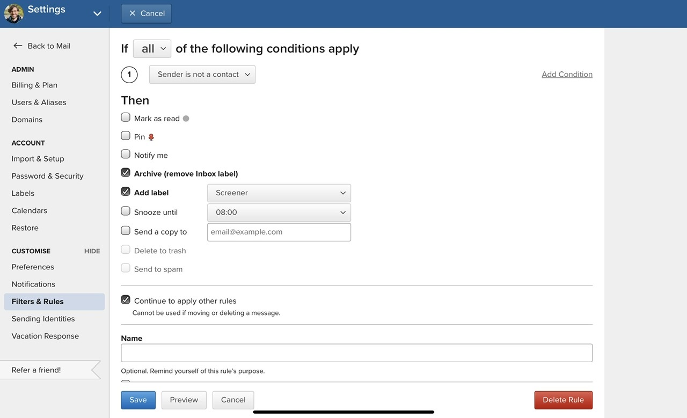

I finally decided to switch from Hey email to a regular email provider. Elements of Hey's approach to email worked well for me so I’d like to replicate some of it in [Fastmail](https://ref.fm/u26272200).

I've seen several helpful articles about setting up a Hey workflow with Fastmail, but they felt a bit combersome for me. I figured out a different approach, and wanted to share what I ended up with. 

## Why Fastmail?

Fastmail came recommended by several friends and has a long history of providing a solid privacy concious service. Here’s what drew me to Fastmail:

* Privacy focused. It’s a paid service, which means they don’t need to sell your information to advertisers to make money and they provide tracking pixel blocking and image proxying.
* It’s about half the price of Hey.
* Supports multiple custom domains.
* Decent iOS apps.

Check out this [more detailed comparison with Hey](https://www.fastmail.com/hey-fastmail/).

## The Workflow

After a little experimentation and playing with the settings this is the workflow I’m now using with Fastmail.

1. Get a new email from an unknown sender. The email lands in the `Screener` label.

2. I review the email and then either: 
    * Block the sender so any future emails go straight to the trash.
    * Add the sender to my contacts and then select which contact group it should belong to. “Feed” or “Paper Trail”. If I want to receive notifications I can make the contact a “VIP” contact.

3. Contacts in the Feed contact group land in the `Feed` label. Contacts in the 'Paper Trail' group land in the `Paper Trail` label. If a contact isn't in either group the email goes to the regular inbox.

This is working well so far and reflects the things about Hey's workflow I found useful.

## The Setup

The key to my workflow is using contacts and contact groups to filter incoming mail into various labels.

(Fastmail can organise emails using folders (one email, one folder) or labels (one email, many labels). For my purposes I’m using labels. This is configured in `Settings -> Preferences` under the `Labels` section.)

### 1. Feed & Paper Trail

First let's setup the Feed and Paper Trail groups and labels. Of course, you don't have to use these specific groups. If you find it useful to have different or more groups then you have the flexibility to add them.

1. Go to `Contacts` and tap `+` in the sidebar to create a new group. Create two groups called `Feed` and `Paper Trail`. 
2. Go to `Settings -> Filters & Rules` and tap `+ Create Rule`.
3. Select `Sender is a member of group...` and select `Feed` for the condition.
4. Tap `Continue`.
5. Tap `Create Rule` next to the search box.
6. In the create rule drop down check the `Archive (remove Inbox label)` and `Add Label`. Create a new label called `Feed`.
7. Repeat steps 2-6 for `Paper Trail`.

Once this is setup we can move on to setup the screener.

### 2. The Screener

Next we'll setup the Screener which will redirect any unknown senders to the `Screener` label where we can review the emails and decide how we want to handle them in the future.

1. Go to `Settings -> Filters & Rules` and tap `+ Create Rule`. 
2. Select `Sender is not a contact` for the condition.
3. Tap `Continue`.
4. Tap `Create Rule` next to the search box.
5. In the create rule drop down check the `Archive (remove Inbox label)` and `Add Label`. Create a new label called `Screener`.

### 3. Extras

At this point you'll be able to use the workflow I described above. But there are a few extra tweaks I made to improve the overall experience. 

#### Recycling old emails

For the `Feed` label I setup "auto-purging". This means that emails older than 31 days will be deleted. In Hey this is configured in the "Recycling Center". 

1. Go to `Settings -> Labels` and tap `Edit` on the label you want to setup auto-purging for.
2. Tap `Show advanced preferences`.
3. Check the option for `Auto-purge` and set the purge time to what ever you prefer.

#### Cleaner sidebar

By default the sidebar will include the usual list of folders (Inbox, All Mail, Sent, Spam, etc). I wanted a simplified sidebar with only what was important. Fortunately this is configurable in Fastmail via `Settings -> Labels`. You can configure labels to always be hidden, always show, or hide when empty.

In my sidebar I now have: 

* **Inbox** - always show.
* **Screener** - hide when empty.
* **Paper Trail** - always show.
* **Feed** - always show.

You can still navigagte to other labels/folders by tapping `Find` at the bottom of the sidebar.

### Notifications

I want to only receive emails from specific senders so I’m not constantly receiving notifications for unimportant messages.

To do this we can configure Fastmail apps to only send notifications for “VIP” contacts. Then for the senders we want notifications for set them as VIP contacts.

## Conclusion

Once this is setup I can screen emails in my `Screener` label and either block them or add them as a contact. Newsletters and marketing emails get added to the `Feed` contact group. Transnational emails such as receipts and service notifications get added to the `Paper Trail` contact group. This leaves any important emails from senders I care about going to the Inbox.
