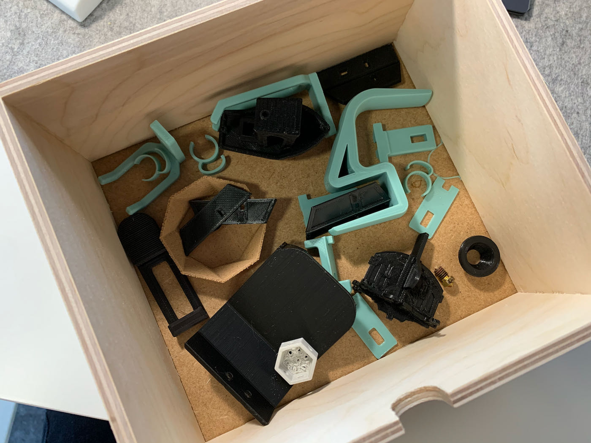

I got myself a 3d printer and I am hooked. I'm hoping to post a bit about some of my projects and learnings soon.

But first I wanted to share this picture of my little box of 3d printing mistakes. 

<!-- excerpt -->

Some are mistakes, some are prototypes, but all of them represent little moments of learning. For each thing in this box I learned something new, which is why I started keeping them rather than throwing them away.

This got me thinking a bit about mistakes I make every day, at work, at home, with people. Some big mistakes I've made in the past that I still cringe at. What if I thought about these like I think about this box of 3d printed pieces? Rather than a mistake representing how I messed up, I could think of them as moments where I learned something. 🤔